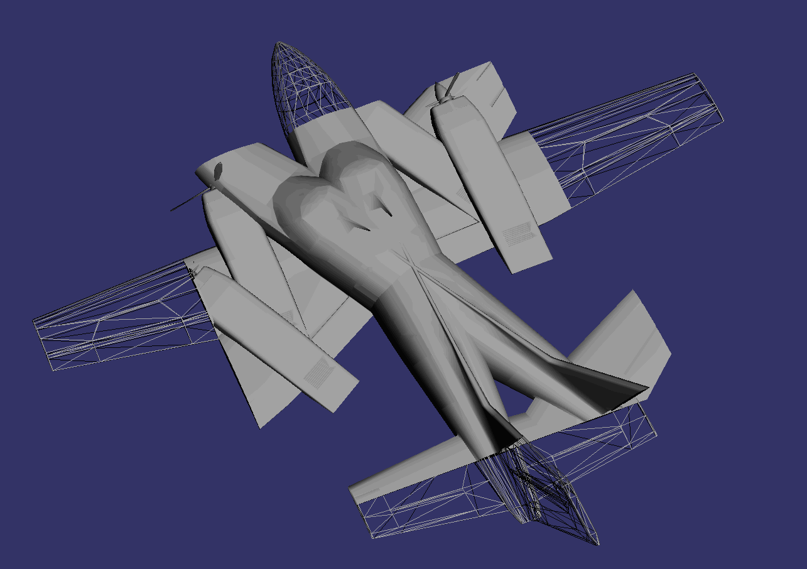

# osg-exercise

## 配置
注意：在运行工程前需要配置OSG的系统环境及OSG的工程环境。
配置系统环境：
　　1) 添加系统变量：OSG_FILE_PATH，变量值为编译好的OSG的data文件夹所在路径；
　　2) 在系统变量的PATH变量中添加：编译好的OSG的bin文件夹所在路径。
配置工程环境：
　　在VS中，右键项目名称，选择“属性”，选择VC++目录，修改包含目录中第一个路径为自己电脑上已经编译好的OSG的include文件夹所在路径，修改库目录中第一个路径为自己电脑上已经编译好的OSG的lib文件夹所在路径。

若在运行程序时遇到报错“找不到Windows SDK版本10.0.17134.0”则可以进行以下操作：
　　1）右键单击“解决方案”，选择“重定解决方案目标”。推荐使用此方法。
　　2）可以修改VS，安装SDK的该版本。此方法较耗时。

## 学习链接：
[OSG-C++/CLI从零开始](https://blog.csdn.net/column/details/22766.html/)

## 0.OSG_0_RunModel  
　　　　

## 1.OSG_1_NodeTransform  
　　　　

## 2.OSG_2_NodeSwitch  
　　　　

## 3.OSG_3_GeometryQuads  
　　　　

## 4.OSG_4_GeometryHouse  
　　　　

## 5.OSG_5_GeometryRotatingLine  
　　　　  
　　　　

## 6.OSG_6_OperatingSimplify  
　　　　

## 7.OSG_7_OperatingDelaunay  
　　　　

## 8.OSG_8_RenderClipeNode  
　　　　  
　　　　

## 9.OSG_9_TextureMultiple  
　　　　

## 10.OSG_10_Texture1D2DCupMap  
　　　　

## 11.OSG_11_TextureCupMap  
　　　　

## 12.OSG_12_Texture3D  
　　　　

## 13.OSG_13_TextureCoords  
　　　　

## 14.OSG_14_TextureLight  
　　　　

## 15.OSG_15_TextureSpotLight  
　　　　

## 16.OSG_16_EventKey
　　　　

## 17. OSG_17_SingleWindowMultipleCameras
　　　　